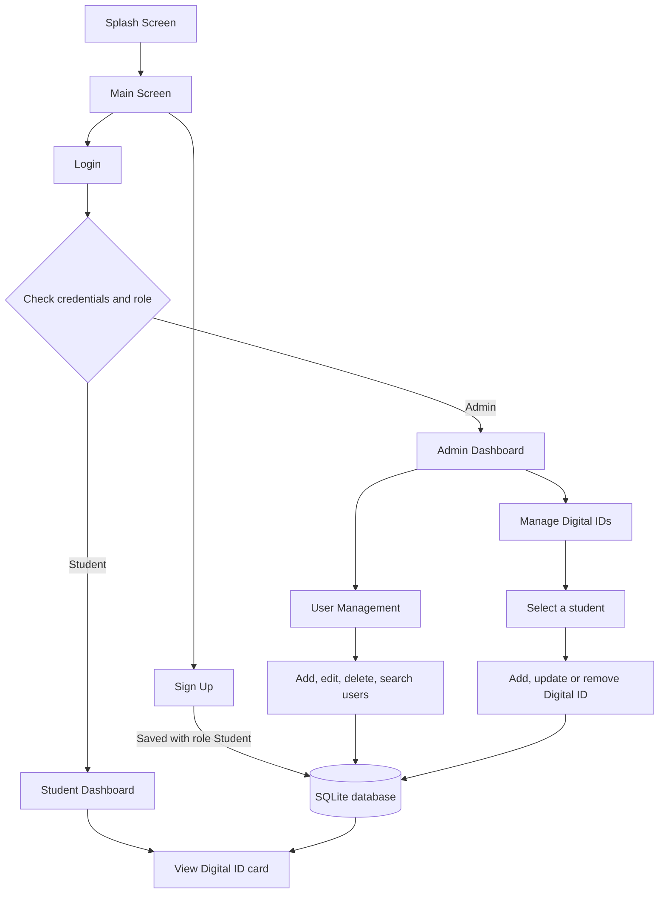
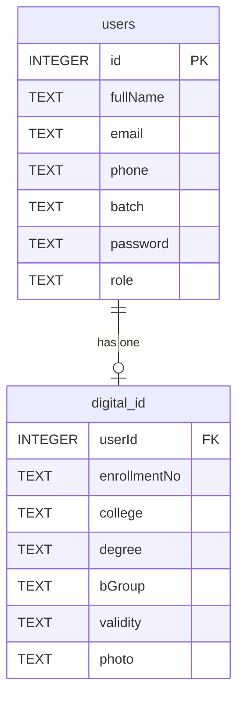

<div align="center">

# 🪪 Digital ID

### Digital Identity Management System for Students

*Mobile Application Development (MAD) — Assignment Project*


**Ganpat University · UVPCE · B.Tech Computer Engineering**

</div>

---

## 📑 Table of Contents

1. [Overview](#-overview)
2. [Features](#-features)
3. [Default Admin Login](#-default-admin-login)
4. [Application Flow](#-application-flow)
5. [Screens](#-screens)
6. [Digital ID Card Design](#-digital-id-card-design)
7. [Database Design](#-database-design)
8. [Student Photograph Handling](#-student-photograph-handling)
9. [Validation and Safety Checks](#-validation-and-safety-checks)
10. [MAD Concepts Demonstrated](#-mad-concepts-demonstrated)
11. [Project Structure](#-project-structure)
12. [How to Run](#-how-to-run)
13. [Screenshots](#-screenshots)
14. [Future Scope](#-future-scope)
15. [Result](#-result)
16. [Author](#-author)

---

## 🎯 Overview

**Digital ID** is an Android application that replaces a physical student ID card with a digital one. Students register and view their official Digital ID. An administrator manages registered users and assigns, updates, or removes each student's Digital ID information and photograph.

The Digital ID card is modelled on the real **Ganpat University student ID card**: a white portrait card with a maroon vertical band, the university logo, a framed photograph, and the student's details.

The project applies the topics covered in the MAD lectures and labs: Activities, layouts, Material components, RecyclerView with an Adapter, SQLite CRUD operations, explicit Intents, image selection, and internal storage.

---

## ✨ Features

### 👨‍🎓 Student

| Feature | Description |
|---|---|
| Sign up | Create an account with name, email, phone, batch year and password. New accounts are always created with the **Student** role |
| Log in | Authenticate using email and password |
| Dashboard | Personalised greeting loaded from SQLite |
| View Digital ID | See the assigned Digital ID card with photograph and details |
| Log out | End the session and return to the main screen |

### 👨‍💼 Admin

| Feature | Description |
|---|---|
| **User Management** | Full **CRUD** on registered users (the data collected at sign-up) |
| Create user | Add a user with a chosen role (Student or Admin) |
| Read users | Browse all users in a RecyclerView with role labels |
| Update user | Edit a user's details. Leaving the password blank keeps the existing one |
| Delete user | Remove a user, their Digital ID record and their stored photograph |
| Live search | Filter users instantly by name, email, phone, batch or role |
| **Manage Digital IDs** | View every student with their ID details and status |
| Assign / update ID | Enter or edit enrollment number, college, degree, blood group, validity and photograph |
| Remove ID | Delete a Digital ID and its photograph after confirmation |
| Live search | Filter students by name, enrollment number, batch, college or ID status |

---

## 🔐 Default Admin Login

Because the Role field has been removed from the public Sign Up screen, the app creates a default Admin account on first launch. Use it to log in as Admin. More admins can then be created from **User Management**.

| Field | Value |
|---|---|
| Email | `admin@guni.ac.in` |
| Password | `Admin@123` |

> These credentials are for demonstration and evaluation only.

---

## 🔄 Application Flow



---

## 🖥️ Screens

| # | Screen | Purpose |
|---|---|---|
| 1 | **Splash** | Logo, application name and tagline |
| 2 | **Main** | Entry point with Login and Sign Up |
| 3 | **Sign Up** | Full name, email, phone, batch year, password, confirm password |
| 4 | **Login** | Email and password check against the `users` table, then role-based routing |
| 5 | **Student Dashboard** | Greeting, Digital ID status, View Digital ID, Logout |
| 6 | **Admin Dashboard** | Two action cards: *User Management* and *Manage Digital IDs*, plus Logout |
| 7 | **User Management** | RecyclerView of users with search, add, edit and delete |
| 8 | **Manage Digital IDs** | RecyclerView of students with ID details, status chip, search |
| 9 | **Add / Update Digital ID** | Form with photo picker for enrollment, college, degree, blood group, validity |
| 10 | **Digital ID Card** | The final ID card built dynamically from SQLite data |

---

## 🎨 Digital ID Card Design

The card follows the layout of the physical university ID:

- **Maroon vertical band** on the left with the rotated **STUDENT** label and repeated small university logo marks (`guni_vector`, a vector drawable that stays sharp at any size)
- **University logo** centred at the top
- **Framed photograph**: rounded rectangle with a maroon border, cropped to fill the frame
- **Student name** in capitals and the **enrollment number**
- **Details table** (`TableLayout`): College, Degree, Blood Group, Mobile, Validity
- Rounded corners, soft elevation, and a scrollable layout that fits small and large phones

The app uses a consistent design system: a navy and gold palette for the app screens, Material cards with 16dp corners, outlined text fields, status chips (green *Assigned*, orange *Pending*), and colours and text held in resource files.

---

## 🗄️ Database Design

The app uses a local **SQLite** database managed through `DatabaseHelper`.



### `users`
Stores account and basic student information.

| Field | Description |
|---|---|
| `id` | Unique user ID (primary key) |
| `fullName` | User's name |
| `email` | University email (unique) |
| `phone` | Mobile number |
| `batch` | Academic batch |
| `password` | Account password |
| `role` | `Student` or `Admin` |

### `digital_id`
Stores official Digital ID information, linked to a user through `userId`.

| Field | Description |
|---|---|
| `userId` | Related user ID |
| `enrollmentNo` | Enrollment number |
| `college` | College name |
| `degree` | Degree / programme |
| `bGroup` | Blood group |
| `validity` | ID validity |
| `photo` | Path of the stored photograph |

### Operations performed

| Operation | Where it is used |
|---|---|
| **Create** | Sign up, admin *Add user*, assign Digital ID |
| **Read** | Login check, user list, student list, Digital ID display |
| **Update** | Edit user, update Digital ID |
| **Delete** | Delete user (with their ID and photo), remove Digital ID |

---

## 🖼️ Student Photograph Handling

1. The admin selects an image using the Android image picker.
2. The image is shown in a preview `ImageView`.
3. The image is copied into the app's **internal storage**.
4. Its file path is saved in the `digital_id` table.
5. The saved path is used to display the photograph in the student list and on the Digital ID card.
6. When an ID or user is deleted, the stored photograph file is deleted too, so no orphaned files remain.

---

## ✅ Validation and Safety Checks

- Required fields must be filled on every form.
- Email format is validated and duplicate emails are rejected (including when editing a user).
- Password and confirm password must match on sign up.
- A student photograph must be selected before saving a Digital ID.
- If a Digital ID already exists it is **updated**, otherwise a new one is **inserted**.
- Deletions always ask for confirmation in an alert dialog.
- The admin who is logged in and the last remaining admin cannot be deleted.
- Passwords are never displayed in any list.
- Public sign up can only create **Student** accounts.

---

## 📚 MAD Concepts Demonstrated

| Concept | Where it is used |
|---|---|
| Activities and Activity Life Cycle | Every screen is an Activity initialised in `onCreate` |
| XML-based UI design | All layout files in `res/layout` |
| ConstraintLayout | Screen layouts throughout the app |
| MaterialCardView | Dashboard action cards, list rows, Digital ID card |
| TextInputLayout / TextInputEditText | Login, sign up and all form screens |
| Buttons, TextView, ImageView | All screens |
| TableLayout and TableRow | Details section of the Digital ID card |
| RecyclerView and Adapter | Student list and user list |
| Explicit Intent | Navigation between screens and passing the selected user or student |
| SQLite and DatabaseHelper | Storage for users and Digital IDs |
| Insert, Retrieve, Update and Delete | Full CRUD across the two tables |
| Data validation | Sign up, login and admin forms |
| Image selection | Photo picker on the Add / Update Digital ID screen |
| Internal storage | Saved student photographs |
| AlertDialog and Toast | Delete confirmations and user feedback |
| TextWatcher | Live search filtering in both lists |
| Vector drawable | Scalable university logo used on the ID card |
| Themes, styles, colours, strings | Central design system in `res/values` |
| Role-based navigation | Student and Admin dashboards after login |

---

## 🧱 Project Structure

```text
Digital ID
│
├── SplashActivity                 Splash and default admin creation
├── MainActivity                   Login / Sign Up entry
├── LoginActivity                  Authentication and role-based routing
├── SignupActivity                 Student registration
│
├── StudentDashboardActivity       Student home
├── DigitalIDActivity              Digital ID card display
│
├── AdminDashboardActivity         Admin home with action cards
├── UserManagementActivity         CRUD on registered users
├── StudentListActivity            Manage Digital IDs list
├── AddDigitalIDActivity           Add / update Digital ID
│
├── DatabaseHelper                 SQLite create, read, update, delete
├── User                           User model
├── DigitalID                      Digital ID model
├── StudentListItem                Row model for the student list
└── StudentAdapter                 RecyclerView adapter
```

```text
res/
├── layout/      activity_*.xml, item_*.xml
├── drawable/    guni_vector.xml (university logo), shapes and gradients
└── values/      colors.xml, strings.xml, themes.xml
```

---

## ▶️ How to Run

1. Clone the repository:
   ```bash
   git clone https://github.com/SVJ1022/24012011180_VRAJ_SONI_MAD_ASSIGNMENT_PROJECT.git
   ```
2. Open the project in **Android Studio**.
3. Wait for Gradle synchronisation to finish.
4. Run the app on an emulator or an Android device.
5. **As Admin:** log in with the [default admin account](#-default-admin-login), open **Manage Digital IDs**, select a student and assign an ID with a photograph.
6. **As Student:** sign up with a new account, log in, and open **View Digital ID**.

> Tip: create a student account first, then log in as Admin to assign that student's Digital ID.

---

## 📸 Screenshots

<div align="center">

| Splash | Main | Sign Up |
|:---:|:---:|:---:|
|  |  |  |

| Login | Student Dashboard | Digital ID Card |
|:---:|:---:|:---:|
|  |  |  |

| Admin Dashboard | User Management | Manage Digital IDs |
|:---:|:---:|:---:|
|  |  |  |

| Add / Update Digital ID | Live Search |
|:---:|:---:|
|  |  |

</div>

---

## 🚀 Future Scope

- Store passwords as salted hashes.
- Add a barcode or QR code to the Digital ID card for quick verification.
- On-device face detection to confirm that an uploaded ID photo contains exactly one face.
- Export the Digital ID card as an image or PDF.
- Sync data to a cloud backend so IDs are available across devices.

---

## 📝 Result

The **Digital ID** application was developed as a complete Android project with separate Student and Admin roles. It stores users and Digital ID data in SQLite, supports full CRUD through RecyclerView-based screens with live search, saves student photographs in internal storage, and renders a Digital ID card that closely follows the Ganpat University student ID design, built dynamically from stored data.

---

## 👨‍💻 Author

**Vraj Soni**
Enrollment No: 24012011180
B.Tech Computer Engineering (Batch 2024–2028)
UVPCE, Ganpat University
